# Banco de Preços em Saúde — Compras Públicas 2020–2026

**Mini-Projeto Avaliativo · Módulo 2 · Semana 07**
Visualização de Dados e Business Intelligence
**Aluna:** Anaysa Pereira Lopes

Dashboard analítico das compras de medicamentos e dispositivos médicos
registradas no Banco de Preços em Saúde (BPS) do Ministério da Saúde entre 2020
e 2026, construído sobre uma base consolidada de **367.365 registros** e
**R$ 115,07 bilhões** em valor registrado.

---

## Sumário

1. [Objetivo do projeto](#1-objetivo-do-projeto)
2. [Contextualização do problema](#2-contextualização-do-problema)
3. [Fonte dos dados](#3-fonte-dos-dados)
4. [Procedimentos de download e concatenação](#4-procedimentos-de-download-e-concatenação)
5. [Tratamentos e transformações](#5-tratamentos-e-transformações)
6. [Principais colunas utilizadas](#6-principais-colunas-utilizadas)
7. [KPIs e métricas](#7-kpis-e-métricas)
8. [Dashboard](#8-dashboard)
9. [Principais análises e descobertas](#9-principais-análises-e-descobertas)
10. [Recomendações](#10-recomendações)
11. [Limitações](#11-limitações)
12. [Como reproduzir o projeto](#12-como-reproduzir-o-projeto)
13. [Estrutura do repositório](#13-estrutura-do-repositório)
14. [Situação da entrega](#14-situação-da-entrega)

---

## 1. Objetivo do projeto

O objetivo deste projeto é transformar os dados públicos do Banco de Preços em
Saúde numa ferramenta real de acompanhamento das compras da área da saúde. Na
prática isso significa construir KPIs, visuais e filtros interativos que deem
conta de responder duas coisas: onde está concentrado o gasto público
registrado, e quais preços unitários se afastam o bastante do normal pra
merecerem uma conferência antes de virarem referência de compra.

Resumindo tudo numa frase só, a pergunta que guia o projeto do início ao fim é:

> **Onde está concentrado o gasto público registrado no BPS entre 2020 e 2026, e
> quais registros de preço unitário se afastam tanto da mediana do próprio item
> que merecem verificação antes de servirem de referência para uma nova compra?**

Dessa pergunta central saíram as 18 perguntas de negócio mais específicas que
usei pra desenhar o dashboard, listadas em
[`docs/perguntas_de_negocio.md`](docs/perguntas_de_negocio.md).

---

## 2. Contextualização do problema

A aquisição de medicamentos, materiais hospitalares e dispositivos médicos
envolve grande volume financeiro, milhares de fornecedores, diferentes
modalidades de compra e uma variedade enorme de produtos. Um gestor público que
vai comprar um medicamento precisa saber por quanto esse mesmo item já foi
comprado por outras instituições. É justamente pra isso que o BPS existe.

O problema é que a base bruta não dá pra usar do jeito que ela vem. São sete
arquivos anuais separados, distribuídos em `.zip`, com nomes de coluna que não
batem com o dicionário oficial, caracteres corrompidos em parte dos anos e
preços unitários que variam em várias ordens de grandeza pro mesmo produto.

Este projeto tenta resolver os dois lados desse problema ao mesmo tempo:
**consolidar** os sete anos numa base única confiável, e **sinalizar** os
registros cujo preço se afasta tanto da mediana do próprio item que não
deveriam ser usados como referência sem uma conferência antes.

---

## 3. Fonte dos dados

| Item | Detalhe |
|------|---------|
| Origem | Portal Brasileiro de Dados Abertos — Ministério da Saúde |
| Conjunto | [Banco de Preços em Saúde — BPS](https://dadosabertos.saude.gov.br/dataset/bps) |
| Dicionário oficial | [Metadados do BPS](https://dadosabertos.saude.gov.br/dataset/bps/resource/0e76f527-5e7e-417d-9d0b-f46d00afb717) |
| Anos utilizados | 2020, 2021, 2022, 2023, 2024, 2025 e 2026 |
| Licença | Dados abertos — uso livre com citação da fonte |
| Data da extração | 10/09/2026 |
| Atualização da fonte | Semestral |

---

## 4. Procedimentos de download e concatenação

### 4.1. Download

Os arquivos foram baixados via código Python, não manualmente. Ao inspecionar
a página do dataset percebi que o portal é uma aplicação web e que o botão
"Baixar" de cada ano aponta pra um arquivo `.zip` hospedado no bucket S3 do
Ministério da Saúde, sempre com o mesmo padrão de URL:

```
https://s3.sa-east-1.amazonaws.com/ckan.saude.gov.br/BPS/csv/<ANO>_csv.zip
```

Como o padrão é sempre igual, deu pra automatizar o download e a
descompactação direto em
[`notebooks/BPS_20_26_projeto_completo.ipynb`](notebooks/BPS_20_26_projeto_completo.ipynb),
na seção **BASES**. Isso tem uma vantagem extra: qualquer pessoa roda o
notebook do zero e chega exatamente na mesma camada raw que eu cheguei.

| Ano | Arquivo | CSV | Registros |
|-----|---------|-----|-----------|
| 2020 | `2020_csv.zip` | 50,07 MB | 84.919 |
| 2021 | `2021_csv.zip` | 50,42 MB | 85.012 |
| 2022 | `2022_csv.zip` | 53,22 MB | 89.546 |
| 2023 | `2023_csv.zip` | 20,79 MB | 33.809 |
| 2024 | `2024_csv.zip` | 17,83 MB | 28.815 |
| 2025 | `2025_csv.zip` | 22,03 MB | 34.174 |
| 2026 | `2026_csv.zip` |  7,47 MB | 11.090 |
| **Total** | | **221,8 MB** | **367.365** |

### 4.2. Concatenação

A concatenação foi feita em Python, com pandas: um `pd.concat()` simples,
empilhando os sete anos um embaixo do outro (append vertical).

Antes de juntar tudo, o notebook confere se as sete bases têm exatamente o
mesmo conjunto de colunas, na mesma ordem — e para com erro se não tiverem.
Sem essa checagem, um append silencioso ia gerar colunas cheias de nulo sem
avisar nada.

**Resultado do append: zero perda de linhas.**

| Etapa | Linhas |
|-------|--------|
| Soma dos sete anos tratados | 367.365 |
| Base consolidada | 367.365 |
| Perda no append | **0** |
| `cd_seq_bps` repetido entre anos | **0** |

### 4.3. Arquitetura de camadas

O projeto segue a mesma arquitetura em camadas usada nas aulas do módulo:

```
RAW       dados/raw/       arquivos originais, como vieram do portal
   ↓
STAGING   dados/staging/   cada ano padronizado, tipado e limpo
   ↓
CURATED   dados/curated/   base única consolidada, pronta para o BI
```

---

## 5. Tratamentos e transformações

Executados por
[`notebooks/BPS_20_26_projeto_completo.ipynb`](notebooks/BPS_20_26_projeto_completo.ipynb),
nas seções **TRATAMENTO** e **CONCATENAÇÃO**.
O diagnóstico que motivou cada tratamento está em
[`docs/mapeamento_de_discrepancias.md`](docs/mapeamento_de_discrepancias.md) e a
evidência de execução em
[`relatorios/relatorio_tratamento.txt`](relatorios/relatorio_tratamento.txt).

### 5.1. Correção de caracteres corrompidos (encoding)

Os sete arquivos são UTF-8 válido, nenhum deles dá erro de decodificação. Mas
isso não quer dizer que estão limpos: de 2020 a 2023 tem texto **duplamente
codificado** na origem, um texto que já era UTF-8 foi lido como Latin-1 e
gravado de novo em UTF-8.

| Aparecia como | Corrigido para |
|---------------|----------------|
| `Pregão 217/2022` | `Pregão 217/2022` |
| `ARP Nº 177/FMS/2022` | `ARP Nº 177/FMS/2022` |
| `n° 25/2022` | `n° 25/2022` |

Foram **7.329 valores corrigidos**, todos na coluna `nu_processo_compra`
(2020: 1.876 · 2021: 1.955 · 2022: 2.742 · 2023: 756 · 2024–2026: nenhum).

A correção funciona reescrevendo o texto em Latin-1 e reinterpretando como
UTF-8. O truque é que, se o texto já estiver correto, essa operação dá erro
sozinha e o valor original fica intacto. Por segurança, testei em 13.512
descrições que já estavam certas, e nenhuma delas foi alterada.

### 5.2. Padronização de nomes de colunas

O dicionário oficial usa nomes de negócio ("Qtd Itens Comprados") e o arquivo
usa nomes técnicos (`qt_medicamento`), sem nenhuma tabela de-para publicada.
Montei esse de-para na mão e renomeei só o que gerava ambiguidade, seguindo os
prefixos usados no módulo (`nr_`, `dt_`, `vl_`, `qt_`, `cd_`, `nm_`, `ds_`,
`fg_`):

| Original | Renomeada | Motivo |
|----------|-----------|--------|
| `qt_medicamento` | `qt_itens_comprados` | O campo cobre medicamentos **e** dispositivos |
| `ano_compra` | `nr_ano_compra` | Prefixo de número |
| `modalidade` | `ds_modalidade_compra` | Prefixo de descrição |
| `registro_anvisa` | `cd_registro_anvisa` | Prefixo de código |
| `co_catmat` | `cd_catmat` | Padroniza o prefixo de código |
| `co_seq_bps` | `cd_seq_bps` | Padroniza o prefixo de código |
| `validade_compra` | `nr_validade_compra` | Prefixo de número |

### 5.3. Tipos de dados e formatos

- **Leitura como texto puro** (`dtype=str`) na entrada, de propósito: os CNPJs
  têm zeros à esquerda que o pandas apagaria se eu deixasse converter pra
  número direto.
- **Datas:** o arquivo traz `DD/MM/AAAA` (padrão brasileiro) como texto.
  Convertidas com `format="%d/%m/%Y"` e gravadas em ISO `AAAA-MM-DD`, que é o
  formato que o BigQuery e o Looker Studio leem sem precisar de ajuste.
- **Números:** já vinham com ponto decimal (padrão inglês), só precisaram de
  tipagem pra `float` e `Int64`.
- **Textos:** removi espaços nas pontas, colapsei espaços múltiplos e deixei
  UF sempre em caixa alta.

### 5.4. Valores nulos, vazios e inconsistentes

Nenhuma coluna foi preenchida com valor inventado.

| Situação | Tratamento |
|----------|------------|
| Campos categóricos vazios (`no_classe`, `no_pdm`, `un_fornecimento`, `no_instituicao`, `un_medida_capacidade`) | Categoria explícita `"Não informado"` — o registro continua aparecendo nos gráficos em vez de sumir |
| `fg_generico` (`S`/`N`/vazio) | Convertido para `Generico` / `Nao generico` / `Nao informado` |
| `cd_registro_anvisa` vazio | `"Sem registro informado"` |
| `nu_ata` vazio | `"Sem ata informada"` |
| Data, valor ou quantidade ausentes | Registro descartado — sem eles nenhum KPI se sustenta |
| Quantidade ou preço unitário ≤ 0 | Registro descartado |

No fim, nenhum registro precisou ser descartado por esses critérios: os
367.365 registros que entraram na camada raw chegaram íntegros até a curated.

### 5.5. Duplicidades

Avaliei por dois critérios, dentro de cada ano e no consolidado:

| Critério | Resultado |
|----------|-----------|
| Linha inteira idêntica | 0 |
| `cd_seq_bps` repetido dentro do ano | 0 |
| `cd_seq_bps` repetido entre anos | 0 |

O `cd_seq_bps` é o identificador do registro no BPS e se mostrou uma chave
confiável nos sete anos. Deixei a verificação no código mesmo assim, pra
proteger execuções futuras quando o Ministério publicar novas cargas.

### 5.6. Consistência matemática

Conferi se `vl_preco_total` bate com `vl_preco_unitario × qt_itens_comprados`
em toda a base: 367.365 de 367.365 registros conferem, 0% de divergência. Isso
mostra que a base é aritmeticamente consistente. O problema que ela tem não
está na conta — está na plausibilidade dos preços, que é o que a seção 9
detalha.

### 5.7. Nenhuma coluna do BPS foi descartada

As **36 colunas originais** publicadas pelo Ministério da Saúde seguem íntegras
na base consolidada, inclusive as de pouco uso analítico (`no_grupo`, que tem
o mesmo valor em 98,7% dos registros, e `ds_observacao`, texto livre vazio em
até 72% dos casos dependendo do ano).

O enunciado pede a **consolidação** das bases anuais numa estrutura única, não
pede pra reduzir o conjunto de colunas publicado. Por isso optei por manter
tudo: assim não sobra nenhuma dúvida sobre perda de dado na consolidação. A
base só ganha colunas novas ao longo do tratamento, nunca perde as originais.

### 5.8. Colunas calculadas criadas

Cada uma responde a uma exigência específica do enunciado:

| Coluna | Como é calculada | Exigência que atende |
|--------|------------------|----------------------|
| `ds_tipo_produto` | `Medicamento` se `no_classe` = `DROGAS E MEDICAMENTOS`, senão `Dispositivo medico` | Desafio: *"Medicamentos e dispositivos médicos mais adquiridos"* |
| `qt_registros_item_comparavel` | Contagem do grupo `cd_catmat` + `un_fornecimento` | Sprint 3: *"Definir os critérios utilizados para comparação de preços entre produtos"* |
| `vl_preco_unitario_mediano_item` | Mediana do preço unitário do grupo comparável (mín. 5 registros) | Sprint 3: *"Criar os campos calculados necessários"* |
| `vl_indice_preco_vs_mediana` | `vl_preco_unitario` ÷ mediana do item | Desafio: *"Variação dos preços unitários entre produtos, instituições, fornecedores e períodos"* |
| `ds_faixa_alerta_preco` | Faixa do índice acima | Desafio: *"Identificação de oportunidades de investigação sobre diferenças relevantes de preços"* |

Usei mediana em vez de média de propósito: a média seria distorcida
justamente pelos registros extremos que esse indicador existe pra detectar,
enquanto a mediana não se mexe quando aparece um preço absurdo isolado dentro
do grupo.

Além dessas, a camada **staging** carrega colunas auxiliares de calendário
(`nr_mes_compra`, `nm_mes_compra`, `nr_trimestre_compra`, `ds_ano_mes`) e de
auditoria (`vl_preco_total_calculado`, `vl_diferenca_preco_total`,
`cd_item_comparavel`), usadas na análise em Python. Elas não vão pra base
final porque o Looker Studio deriva mês, trimestre e ano-mês sozinho a partir
de `dt_compra` — nenhuma delas é dado original do BPS.

### 5.9. Decisão de arquitetura: por que BigQuery

A base consolidada tem **229 MB** com as 41 colunas. O conector de upload de
arquivo do Looker Studio aceita no máximo **100 MB por conjunto de dados**, e
o GitHub também limita arquivos a **100 MB**.

Tinha duas saídas: cortar colunas pra caber no limite, ou usar uma ferramenta
que não tivesse esse limite. Cortar coluna não dava certo — seria descartar
dado publicado pelo Ministério bem num projeto cujo objetivo é consolidar a
base, não resumir ela.

Optei por manter a base **completa** e carregá-la no **BigQuery**, que aceita
CSV compactado em `gzip` (**33,9 MB**), não tem esse limite de tamanho, é
gratuito no modo Sandbox e é o caminho que vimos na Semana 06. O notebook
grava as duas versões: o `.csv` completo pra uso local e o `.csv.gz` pra carga
na nuvem e pro repositório.

---

## 6. Principais colunas utilizadas

O dicionário completo das 41 colunas está em
[`docs/dicionario_de_dados.md`](docs/dicionario_de_dados.md). As principais:

| Coluna | Tipo | Descrição |
|--------|------|-----------|
| `nr_ano_compra` | Inteiro | Ano da compra — identificação do ano exigida pelo enunciado |
| `dt_compra` | Data | Data da compra, em `AAAA-MM-DD` |
| `sg_uf` / `no_municipio` | Texto | Localização da instituição compradora |
| `ds_esfera` | Texto | `MUNICIPAL`, `ESTADUAL`, `FEDERAL` ou `PRIVADA` |
| `cnpj_instituicao` / `no_instituicao` | Texto | Quem comprou. O **CNPJ** é a chave da contagem distinta |
| `cd_catmat` / `ds_item` / `no_pdm` | Texto | Identificação do produto: código CATMAT, descrição completa e nome padronizado |
| `ds_tipo_produto` | Texto | `Medicamento` ou `Dispositivo medico` |
| `un_fornecimento` | Texto | `COMPRIMIDO`, `AMPOLA`, `FRASCO`… — parte da chave de comparação de preços |
| `cnpj_fornecedor` / `no_fornecedor` | Texto | Quem vendeu. O **CNPJ** é a chave da contagem distinta |
| `no_fabricante` | Texto | Quem fabricou |
| `ds_modalidade_compra` | Texto | `Pregão`, `Registro de Preços`, `Dispensa de Licitação`… |
| `qt_itens_comprados` | Inteiro | Quantidade adquirida |
| `vl_preco_unitario` | Decimal | Preço por unidade — **nunca deve ser somado** |
| `vl_preco_total` | Decimal | Preço unitário × quantidade |
| `vl_indice_preco_vs_mediana` | Decimal | Quantas vezes o preço se afasta da mediana do próprio item |
| `ds_faixa_alerta_preco` | Texto | Faixa de priorização da investigação de preços |

---

## 7. KPIs e métricas

Defini os KPIs na Sprint 3, calculei eles em Python
([`notebooks/BPS_20_26_projeto_completo.ipynb`](notebooks/BPS_20_26_projeto_completo.ipynb),
seção **KPIS**) e depois reproduzi as mesmas fórmulas no Looker Studio. Os
dois valores têm que bater: foi essa conferência cruzada que usei pra validar
se as fórmulas do dashboard estavam certas.

### 7.1. Os seis KPIs obrigatórios

| # | KPI | Fórmula | Agregação | Valor na base completa |
|---|-----|---------|-----------|------------------------|
| 1 | Valor total registrado | `SUM(vl_preco_total)` | Soma | **R$ 115.065.133.095,85** |
| 2 | Quantidade total de itens | `SUM(qt_itens_comprados)` | Soma | **64.809.574.232** |
| 3 | Registros de compra | `COUNT(*)` | Contagem | **367.365** |
| 4 | Instituições compradoras | `COUNT(DISTINCT cnpj_instituicao)` | Contagem distinta | **854** |
| 5 | Fornecedores | `COUNT(DISTINCT cnpj_fornecedor)` | Contagem distinta | **3.668** |
| 6 | Preço unitário médio ponderado | `SUM(vl_preco_total) / SUM(qt_itens_comprados)` | Razão | **R$ 1,78** |

Todos os seis reagem aos filtros do dashboard.

### 7.2. Decisões de agregação e por que elas importam

**O preço médio é ponderado, não uma média simples**

| Cálculo | Resultado |
|---------|-----------|
| Ponderado — `SUM(valor) / SUM(quantidade)` | **R$ 1,78** |
| Média simples de `vl_preco_unitario` | R$ 172,65 |
| Mediana de `vl_preco_unitario` | R$ 1,86 |

A média simples sozinha dá um número quase 100 vezes maior, porque ela trata
do mesmo jeito uma compra de 1 unidade e uma de 90 milhões de comprimidos. Por
isso o KPI oficial é sempre o ponderado.

**Preço unitário nunca é somado**

Somar todos os `vl_preco_unitario` dá R$ 63.425.146,47. É um número que existe,
mas não quer dizer nada: seria somar preço de comprimido com preço de frasco
de anos diferentes, o que não representa nenhuma grandeza real. Por isso no
dashboard o preço unitário só aparece como média, mediana, mínimo, máximo ou
razão — nunca como soma.

**A contagem distinta usa CNPJ, não nome**

| Chave | Instituições | Fornecedores |
|-------|-------------|--------------|
| Por CNPJ | **854** | **3.668** |
| Por nome | 684 | 3.451 |

Reparei que o mesmo CNPJ aparece grafado de jeitos diferentes — "SECRETARIA DE
ESTADO DA SAUDE" é usado por vários estados, por exemplo. Por isso o CNPJ é a
chave certa pra contar, não o nome.

### 7.3. Critério de comparação de preços entre produtos

Dois registros só são comparáveis se tiverem o **mesmo código CATMAT** e a
**mesma unidade de fornecimento**. Comparar só pelo nome do medicamento estaria
errado: `DIPIRONA SÓDICA` existe em comprimido, ampola e frasco, com preços
legitimamente diferentes entre si.

A referência de cada grupo é a **mediana** do preço unitário, exigindo no
mínimo 5 registros no grupo. As faixas de alerta ficaram assim:

| Faixa | Critério | Registros | % | Valor |
|-------|----------|-----------|---|-------|
| 1 - Muito acima | ≥ 5× a mediana | 10.000 | 2,72% | R$ 66,34 bi |
| 2 - Acima | 2× a 5× | 27.737 | 7,55% | R$ 1,83 bi |
| 3 - Faixa esperada | 0,5× a 2× | 296.013 | 80,58% | R$ 41,30 bi |
| 4 - Abaixo | ≤ 0,5× | 19.101 | 5,20% | R$ 4,33 bi |
| 5 - Sem comparação | grupo com < 5 registros | 14.514 | 3,95% | R$ 1,27 bi |

---

## 8. Dashboard

**Link do dashboard:** <https://datastudio.google.com/reporting/f914acb0-3cbe-4566-a37c-c40fe9da1ac8>

> Acesso liberado para qualquer pessoa com o link, em modo visualização.

Construído no Looker Studio sobre a base carregada no BigQuery, em duas
páginas.

**Composição:** 6 cartões de KPI · 8 visuais · 6 filtros interativos.

**Página 1 · Visão Geral**

| Visual | Tipo | Pergunta que responde |
|--------|------|----------------------|
| V1 · Evolução anual | Combinado (barras + linha) | Quanto foi registrado por ano e se o valor cresce por causa de poucas compras grandes |
| V2 · Distribuição geográfica | Mapa por UF | Quais estados concentram o volume financeiro |
| V3 · Instituições compradoras | Barras horizontais | Quais instituições mais compram |
| V4 · Fornecedores | Barras horizontais | Quais fornecedores concentram o valor |
| V5 · Modalidades de compra | Rosca | Quais modalidades são mais utilizadas |

**Página 2 · Investigação de Preços**

| Visual | Tipo | Pergunta que responde |
|--------|------|----------------------|
| V6 · Itens por valor total | Barras horizontais | Quais produtos pesam mais em dinheiro |
| V7 · Itens por quantidade adquirida | Barras horizontais | Quais produtos pesam mais em volume |
| V8 · Registros comparáveis | Tabela mín/mediana/máx | Onde as diferenças de preço merecem verificação |

**Filtros (presentes nas duas páginas, exceto onde indicado):** período · UF ·
esfera administrativa · tipo de produto · faixa de alerta de preço ·
modalidade de compra (só na página 2).

**Capturas — Página 1 · Visão Geral:**

| | |
|---|---|
| 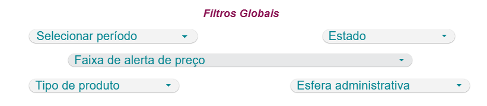 | 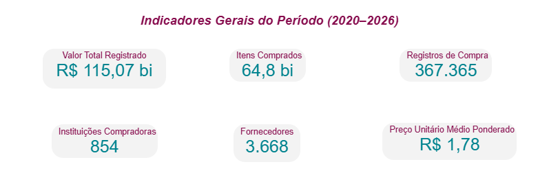 |
| 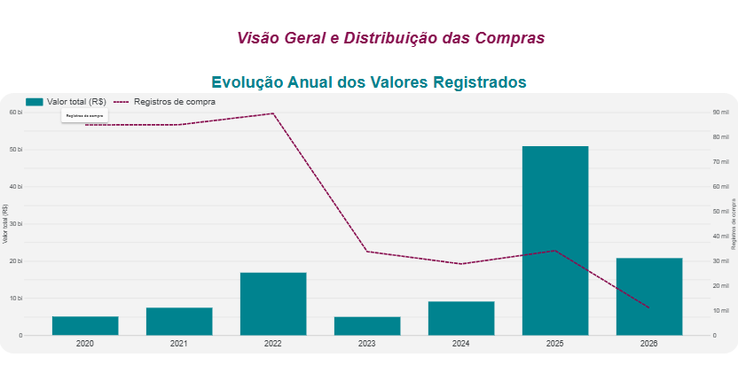 | 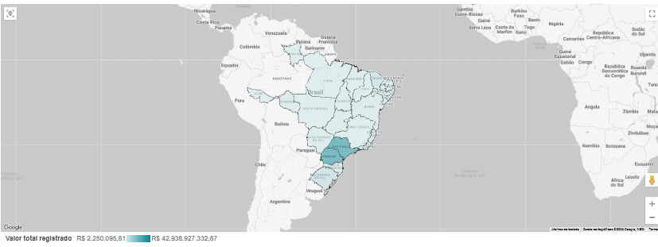 |
| 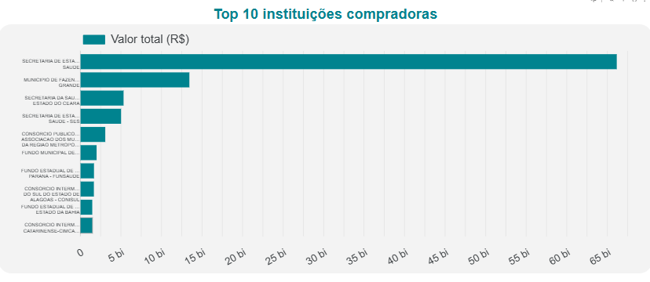 | 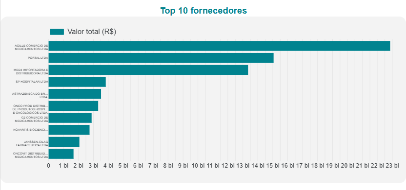 |
| 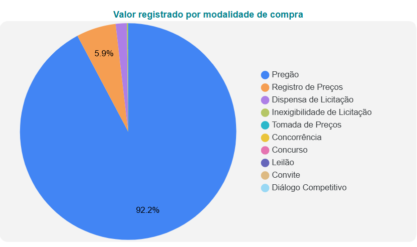 | 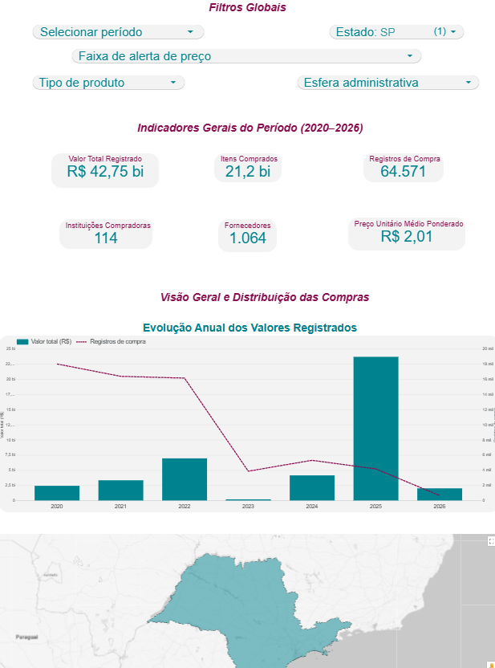 |

**Capturas — Página 2 · Investigação de Preços:**

| | |
|---|---|
| 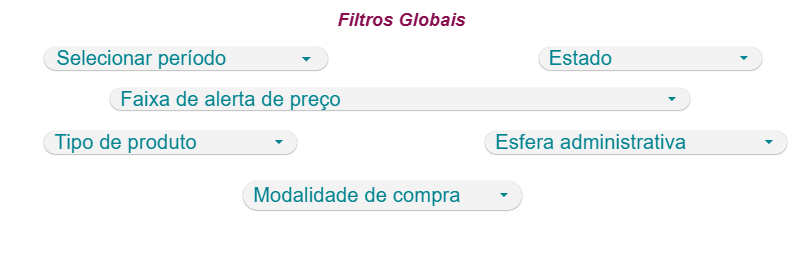 | 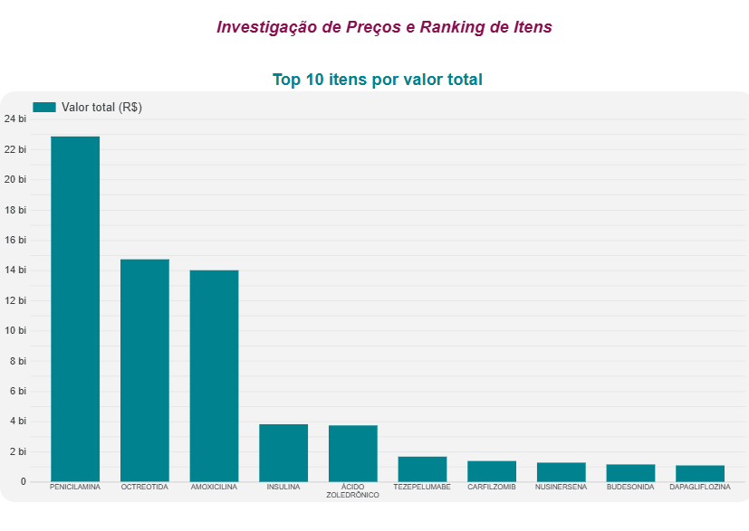 |
| 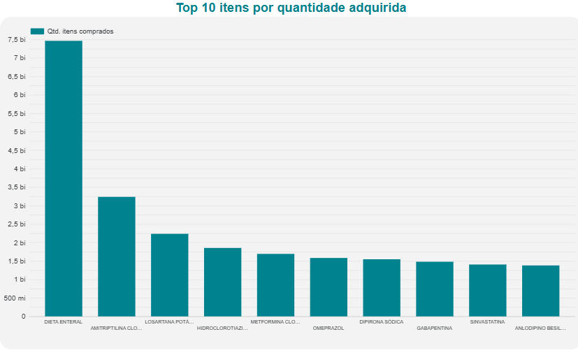 | 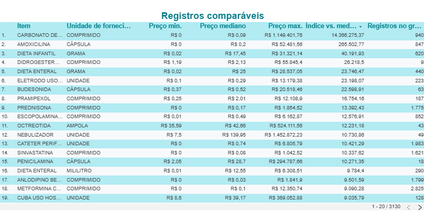 |
| 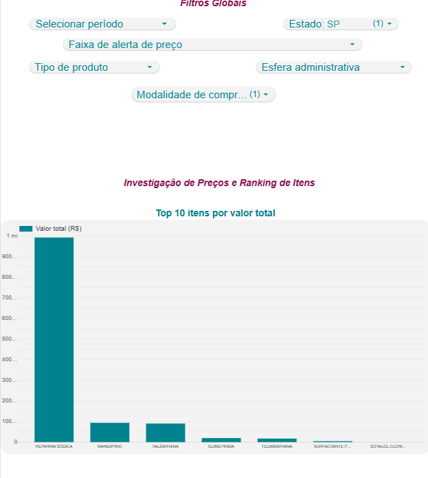 | |

---

## 9. Principais análises e descobertas

Números completos em [`relatorios/relatorio_kpis.txt`](relatorios/relatorio_kpis.txt).

### 9.1. O valor registrado está extraordinariamente concentrado

| Recorte | Valor | % do total |
|---------|-------|-----------|
| 10 maiores registros | R$ 62,86 bi | **54,6%** |
| 100 maiores registros | R$ 77,53 bi | 67,4% |
| 1.000 maiores registros | R$ 95,18 bi | 82,7% |

De 367 mil registros, só dez respondem por mais da metade do valor total da
base. Foi a descoberta que mais me chamou atenção no projeto, e ela muda como
eu leio todos os outros indicadores daqui pra frente.

Pela faixa de alerta o quadro se repete: os 10.000 registros da faixa "muito
acima" são só 2,72% da base, mas concentram R$ 66,34 bilhões — ou seja, 57,7%
de todo o valor registrado.

### 9.2. Essa concentração vem de preços unitários implausíveis

Os dez maiores registros têm preços unitários muito acima da mediana do
próprio item:

| Ano | UF | Item | Qtd | Preço unitário | Valor total | vs. mediana do item |
|-----|----|------|-----|----------------|-------------|---------------------|
| 2025 | PR | PENICILAMINA 250 MG | 77.500 | R$ 294.400,00 | R$ 22,82 bi | **10.258×** |
| 2025 | SP | OCTREOTIDA | 28.060 | R$ 520.000,00 | R$ 14,59 bi | **12.189×** |
| 2026 | PR | AMOXICILINA 500 MG | 261.600 | R$ 51.038,16 | R$ 13,35 bi | **260.399×** |
| 2026 | RS | CARBONATO DE CÁLCIO 500 MG | 699 | R$ 1.149.000,00 | R$ 0,80 bi | **14.362.500×** |

Um comprimido de amoxicilina custando R$ 51 mil, ou um de carbonato de cálcio
a R$ 1,15 milhão, não é preço de mercado de jeito nenhum. A explicação mais
provável é erro de digitação na origem: alguém deve ter lançado o valor total
no campo de preço unitário, ou errou a casa decimal.

E o mais complicado: esses registros são **matematicamente consistentes**
(preço × quantidade bate com o total em 100% dos casos). Uma validação
aritmética comum não pegaria nenhum deles. Só comparando com a mediana do
próprio item é que eles aparecem.

### 9.3. O ranking de estados é um artefato desses registros

| Posição | UF | Valor total | % |
|---------|----|-------------|---|
| 1 | PR | R$ 42,94 bi | 37,3% |
| 2 | SP | R$ 42,75 bi | 37,1% |
| 3 | RS | R$ 6,21 bi | 5,4% |
| 4 | CE | R$ 5,40 bi | 4,7% |
| 5 | RJ | R$ 5,30 bi | 4,6% |

O Paraná lidera o ranking, só que R$ 36,2 bi dos R$ 42,9 bi do estado vêm de
apenas dois registros: a penicilamina e a amoxicilina que já apareceram na
tabela anterior.

Aplicando o filtro que exclui a faixa "1 - Muito acima", o ranking muda de
dono:

| UF | Com todos os registros | Excluindo a faixa "muito acima" | Queda |
|----|------------------------|---------------------------------|-------|
| SP | R$ 42,75 bi (2º) | **R$ 22,46 bi (1º)** | −47% |
| PR | R$ 42,94 bi (1º) | **R$ 5,95 bi (2º)** | **−86%** |
| CE | R$ 5,40 bi (4º) | R$ 5,38 bi (3º) | −0,4% |
| RS | R$ 6,21 bi (3º) | R$ 2,42 bi (4º) | −61% |

O caso que achei mais interessante da tabela é o Ceará: o valor dele quase não
muda quando os registros suspeitos são excluídos, o que é um bom sinal de que
a base de preços do estado é consistente. Isso confirma algo importante: ler
um ranking de UF sem passar o filtro de faixa de alerta antes leva a uma
conclusão errada, e foi por isso que decidi deixar esse filtro no dashboard.

O ranking de fornecedores tem o mesmo problema: os três primeiros (`AGILLE`,
`PORTAL`, `MED4`, que juntos somam 44,6% do valor) estão nessa posição em boa
parte por causa dos mesmos registros suspeitos.

### 9.4. A evolução anual precisa ser lida com essa ressalva

| Ano | Valor total | Variação | Registros | Instituições |
|-----|-------------|----------|-----------|--------------|
| 2020 | R$ 5,05 bi | — | 84.919 | 483 |
| 2021 | R$ 7,42 bi | +47,1% | 85.012 | 479 |
| 2022 | R$ 16,87 bi | +127,3% | 89.546 | 421 |
| 2023 | R$ 4,96 bi | −70,6% | 33.809 | 280 |
| 2024 | R$ 9,09 bi | +83,3% | 28.815 | 241 |
| 2025 | R$ 50,90 bi | **+460,1%** | 34.174 | 215 |
| 2026 | R$ 20,77 bi | −59,2% | 11.090 | 100 |

O salto de 2025 engana: R$ 41,1 bi dos R$ 50,9 bi registrados naquele ano vêm
de só três registros, não de um aumento real de compras. O dado que de fato
importa aqui é outro — o número de instituições que alimentam o BPS caiu de
483 para 215 entre 2020 e 2025, e o total de registros despencou 60% só entre
2022 e 2023. A base está perdendo cobertura ano após ano.

*(2026 é ano parcial — os dados vão até 27/08/2026.)*

### 9.5. Valor e volume apontam para produtos completamente diferentes

| Top por **valor total** | Top por **quantidade adquirida** |
|-------------------------|----------------------------------|
| 1. PENICILAMINA — R$ 22,86 bi | 1. DIETA ENTERAL — 7,46 bi unidades |
| 2. OCTREOTIDA — R$ 14,73 bi | 2. AMITRIPTILINA — 3,24 bi |
| 3. AMOXICILINA — R$ 14,01 bi | 3. LOSARTANA POTÁSSICA — 2,24 bi |
| 4. INSULINA — R$ 3,81 bi | 4. HIDROCLOROTIAZIDA — 1,85 bi |
| 5. ÁCIDO ZOLEDRÔNICO — R$ 3,74 bi | 5. METFORMINA — 1,69 bi |

As duas listas não têm nenhum item em comum. O ranking por quantidade faz
sentido com o perfil epidemiológico brasileiro (hipertensão, diabetes, saúde
mental), e é o que considero mais confiável dos dois porque quantidade não
sofre com os erros de preço que distorcem o outro ranking.

### 9.6. O que a base mostra com solidez

Descobertas que não dependem dos registros extremos:

- **Medicamentos concentram 96,5% do valor** (R$ 111,03 bi em 290.775 registros);
  dispositivos médicos são 3,5% (R$ 4,03 bi em 76.590 registros).
- **O pregão domina:** 92,2% do valor e 332.310 dos 367.365 registros. Dispensa
  de licitação responde por apenas 1,7% do valor.
- **A compra é predominantemente municipal:** 339.384 dos 367.365 registros.
- **Compras judiciais existem e são minoria:** 6.001 registros (1,6%).
- **80,58% dos registros têm preço dentro da faixa esperada.** A base é
  majoritariamente saudável; o problema está concentrado numa minoria de
  altíssimo impacto.

---

## 10. Recomendações

**Para quem usa o BPS como referência de preço**

1. Não usar a média simples de preço unitário como referência — prefira a
   mediana do grupo `cd_catmat` + `un_fornecimento`, que aguenta melhor os
   registros extremos. A diferença entre os dois critérios chega a 97×, então
   isso importa de verdade.
2. Antes de qualquer ranking de UF, instituição ou fornecedor, aplicar o
   filtro de faixa de alerta. Sem ele, o ranking reflete erros de digitação,
   não comportamento real de compra.
3. Sempre consultar o `qt_registros_item_comparavel` antes de confiar num
   preço de referência. Um item com 3 registros não sustenta nada; um com
   800, sim.

**Para o Ministério da Saúde, como gestor da base**

4. **Implantar validação de plausibilidade no momento do cadastro.** Uma regra
   simples — alertar quando o preço unitário informado ultrapassar, por
   exemplo, 20× a mediana histórica do mesmo CATMAT e unidade de fornecimento
   — bloquearia os quatro registros que sozinhos distorcem 45% da base. A
   validação aritmética atual não pega nada, porque os registros errados são
   internamente consistentes.
5. Revisar os 10.000 registros da faixa "muito acima", começando pelos de
   maior valor total. Os 10 primeiros já cobrem R$ 62,9 bi sozinhos.
6. Investigar a queda de cobertura. Passar de 483 para 215 instituições
   informantes compromete a função da base como referência nacional de
   preços. Seria bom entender se houve alguma mudança de obrigatoriedade ou
   de sistema entre 2022 e 2023, período em que o volume de registros caiu
   62%.
7. Publicar a tabela de-para entre os nomes do dicionário oficial e os nomes
   reais das colunas do CSV, e documentar as 12 colunas que hoje existem no
   arquivo sem constar do dicionário.

**Para o gestor que vai comprar**

8. Priorizar a negociação pelos itens de maior volume, não pelos de maior
   valor unitário. Dieta enteral, amitriptilina e losartana movimentam
   bilhões de unidades — um ganho de poucos centavos por unidade nesses itens
   supera qualquer economia em medicamentos de alto custo e baixo volume.

---

## 11. Limitações

**Da base**

1. **Cobertura geográfica incompleta.** Há registros de 24 UFs. AM, AP e DF
   não aparecem em nenhum dos sete anos. O BPS depende de alimentação
   voluntária, então ausência significa "não informou", não "não comprou".
2. **Cobertura decrescente.** O número de instituições informantes caiu de
   483 (2020) para 215 (2025). Comparações entre anos acabam misturando
   variação real de compras com variação de quem estava reportando.
3. **2026 é ano parcial**, os dados vão só até 27/08/2026. Não deve ser
   comparado diretamente com os anos completos.
4. **Erros de preço na origem.** Confirmei registros com preço unitário até
   14 milhões de vezes a mediana do próprio item. Foram sinalizados, não
   corrigidos — alterar dado público sem confirmação da fonte seria pior do
   que deixar como está.
5. **Colunas não documentadas.** 12 das 36 colunas não constam do dicionário
   oficial. A descrição delas neste projeto é inferida a partir dos valores, e
   isso está sinalizado no dicionário de dados.
6. **Alto índice de vazios em campos úteis.** `fg_generico` e
   `cd_registro_anvisa` estão vazios entre 24,8% e 56,3% dos registros,
   dependendo do ano, o que impede uma análise conclusiva sobre participação
   de genéricos.

**Da análise**

7. A mediana de referência é calculada sobre todo o período 2020–2026, sem
   correção de inflação. Um preço de 2026 acaba sendo comparado com uma
   mediana que inclui 2020. Pras distorções encontradas (milhares de vezes a
   mediana) isso não muda nada, mas pra diferenças na faixa de 2× a 5× a
   inflação do período pode explicar parte da variação.
8. 3,95% dos registros ficam sem base de comparação por pertencerem a grupos
   com menos de 5 registros.
9. A comparabilidade por CATMAT + unidade de fornecimento não captura tudo.
   Fabricante, marca, quantidade adquirida, prazo de entrega e condição de
   pagamento continuam influenciando o preço e não entram nesse critério.
10. A faixa de alerta é um indicador de priorização, não de irregularidade.
    Diferença de preço não comprova sobrepreço nem irregularidade — as
    variações podem vir de fabricante, apresentação, unidade de fornecimento,
    quantidade, localidade, modalidade e período da negociação.

---

## 12. Como reproduzir o projeto

### Pré-requisitos

- Python 3.10 ou superior
- Jupyter Notebook (instalado pelo `requirements.txt`)
- Conta Google (para BigQuery Sandbox e Looker Studio)
- ~500 MB livres em disco

### Passo a passo

```bash
# 1. Clonar o repositório
git clone https://github.com/AnaysaLopes/bps-2020-2026-compras-saude.git
cd bps-2020-2026-compras-saude

# 2. Instalar as dependências
pip install -r requirements.txt

# 3. Abrir o notebook e executar todas as células, na ordem
jupyter notebook notebooks/BPS_20_26_projeto_completo.ipynb
```

O notebook faz o projeto inteiro: download, diagnóstico, tratamento,
concatenação, KPIs e análises. O download só acontece na primeira execução;
depois disso os arquivos já estão em disco e a etapa é pulada.

**Tempo total:** cerca de 6 minutos, sendo ~2 minutos de download.

**O que é gerado:**

| Arquivo | Conteúdo |
|---------|----------|
| `dados/raw/*.zip` e `*.csv` | Sete bases anuais originais |
| `dados/staging/BPS_<ANO>_tratado.csv` | Cada ano padronizado e limpo |
| `dados/curated/BPS_20_26_AnaysaPereiraLopes.csv` | **Base consolidada** (229 MB) |
| `dados/curated/BPS_20_26_AnaysaPereiraLopes.csv.gz` | Base consolidada compactada (33,9 MB) — é esta que sobe para o BigQuery |
| `relatorios/relatorio_discrepancias.txt` | Diagnóstico da Sprint 1 |
| `relatorios/relatorio_tratamento.txt` | Log completo do tratamento |
| `relatorios/relatorio_kpis.txt` | KPIs, validação e rankings |

A base consolidada foi então carregada no BigQuery e conectada ao Looker
Studio, onde montei o dashboard.

### Como obter a base consolidada sem rodar o notebook

O arquivo `BPS_20_26_AnaysaPereiraLopes.csv` tem **229 MB**, acima do limite
de 100 MB do GitHub, então não é versionado. A versão compactada
(`.csv.gz`, 33,9 MB) também não fica na árvore de arquivos do repositório,
porque o upload pelo navegador do GitHub só aceita até 25 MB por arquivo.

Em vez de dividir o arquivo, publiquei o `.csv.gz` completo como anexo de uma
**Release** do repositório (Releases aceitam arquivos bem maiores que o
upload comum):

> **Base consolidada (.csv.gz, 33,9 MB):**
> <https://github.com/AnaysaLopes/bps-2020-2026-compras-saude/releases/tag/v1.0>

Ele descompacta exatamente no CSV consolidado — mesmo conteúdo, mesmas
367.365 linhas, mesmas 41 colunas:

```bash
# Windows (PowerShell) ou Linux/Mac, com Python já instalado
python -c "import gzip,shutil; shutil.copyfileobj(gzip.open('BPS_20_26_AnaysaPereiraLopes.csv.gz','rb'), open('BPS_20_26_AnaysaPereiraLopes.csv','wb'))"
```

Ou, com 7-Zip, basta clicar com o botão direito no `.gz` → **Extrair aqui**.

O `.gz` também é o arquivo usado na carga do BigQuery, então ele nem precisa
ser descompactado pra o dashboard funcionar.

> Os arquivos das camadas raw e staging, além do `.csv` puro e do `.csv.gz`,
> não estão versionados na árvore de arquivos (ver `.gitignore`) — são
> regerados pelo notebook ou obtidos pela Release acima.

---

## 13. Estrutura do repositório

```
bps-2020-2026-compras-saude/
├── README.md                           documentação do projeto
├── requirements.txt                    dependências Python
├── .gitignore
│
├── notebooks/
│   └── BPS_20_26_projeto_completo.ipynb           TODO o pipeline, do download à análise
│
├── dados/                               gerada localmente pelo notebook (raw/staging/curated
│                                        não versionados — ver seção 12 e .gitignore)
│
├── docs/
│   ├── perguntas_de_negocio.md         as 18 perguntas do dashboard
│   ├── mapeamento_de_discrepancias.md  diagnóstico das divergências entre anos
│   └── dicionario_de_dados.md          as 41 colunas da base final
│
├── relatorios/                         evidências de execução
└── imagens/                            capturas do dashboard
```

---

## 14. Situação da entrega

| # | Item da entrega | Situação |
|---|-----------------|----------|
| 1 | Base consolidada 2020–2026 | ✅ 367.365 registros — publicada como Release do repositório (ver seção 12) |
| 2 | Dashboard no Looker Studio | ✅ publicado, com 6 KPIs, 8 visuais e 6 filtros, em 2 páginas — [link](https://datastudio.google.com/reporting/f914acb0-3cbe-4566-a37c-c40fe9da1ac8) |
| 3 | README.md documentado | ✅ este arquivo |
| 4 | Publicação no GitHub | ✅ [repositório publicado](https://github.com/AnaysaLopes/bps-2020-2026-compras-saude), com branches e commits por funcionalidade |

O link do dashboard está na seção [8](#8-dashboard).

---

## Fonte e créditos

Dados: **Banco de Preços em Saúde (BPS)** — Ministério da Saúde, Portal
Brasileiro de Dados Abertos. Dados públicos, extraídos em 10/09/2026.

Projeto desenvolvido individualmente por **Anaysa Pereira Lopes** para o
Mini-Projeto Avaliativo do Módulo 2 — Semana 07 do curso de Visualização de Dados
e Business Intelligence.
